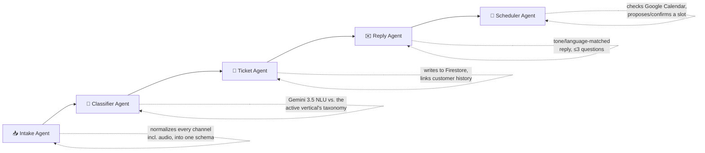

# Taskmaster

**Turn messy, unstructured customer messages into clean, actionable tickets and booked appointments — in under 30 seconds, with no human in the loop for standard requests.**

Built for the **All Things Agentic Hackathon 2026** (Google + Devpost) — deadline **Aug 31, 2026**.

---

## Table of contents

- [What is Taskmaster](#what-is-taskmaster)
- [Why it matters](#why-it-matters)
- [Architecture — the 5-agent pipeline](#architecture--the-5-agent-pipeline)
- [Vertical-agnostic by design](#vertical-agnostic-by-design)
- [Channels](#channels)
- [Tech stack](#tech-stack)
- [Project status](#project-status)
- [Repository structure](#repository-structure)
- [Getting started](#getting-started)
  - [Backend](#backend)
  - [Frontend](#frontend)
  - [Docker Compose (both at once)](#docker-compose-both-at-once)
- [Environment variables](#environment-variables)
- [Running tests](#running-tests)
- [Documentation](#documentation)
- [Team](#team)

---

## What is Taskmaster

Taskmaster is an autonomous multi-agent system that reads an inbound customer message — email,
SMS, a web form, Slack, or a spoken voice message — and turns it into a structured support ticket
(and a booked appointment, when one is needed) without a human touching it for standard requests.

**IT support / MSPs is the flagship vertical and the demo**, but the architecture is
vertical-agnostic by design. The same pipeline can serve dental clinics, plumbing and home
services, auto repair shops, salons, property managers, law firms — any business that receives a
high volume of inbound requests and books appointments. What changes per vertical is
**configuration** (taxonomy, urgency rules, tone, appointment types) — **never code**. Adding a new
vertical is a config file, not an engineering task — see [`app/verticals/`](backend/app/verticals).

## Why it matters

Taskmaster isn't "ticket automation." It's the difference between a customer waiting four hours
for any sign of life, and that same customer getting an intelligent, specific, empathetic reply in
under 30 seconds.

**Latency and empathy are the product.** Anything that adds seconds or reads like a robot is a bug.

## Architecture — the 5-agent pipeline

Each agent normalizes, enriches, and passes state to the next.



| #   | Agent          | Responsibility                                                                                                                                                                                                                                                                                        |
| --- | -------------- | ----------------------------------------------------------------------------------------------------------------------------------------------------------------------------------------------------------------------------------------------------------------------------------------------------- |
| 1   | **Intake**     | Normalizes messages from every channel (including audio) into one internal schema; detects language; extracts sender name, email, phone, company; assigns `intake_id` + timestamp.                                                                                                                    |
| 2   | **Classifier** | The core. Uses **Gemini 3.5** for deep NLU of messy, incoherent, angry, multilingual, half-finished messages. Outputs `issue_type` and `urgency` from the **active vertical's taxonomy**, extracted entities, missing critical info, a sentiment/frustration read, and a calibrated confidence score. |
| 3   | **Ticket**     | Builds the structured ticket, assigns number/priority/category/status, writes to Firestore, links customer history, routes to the right person.                                                                                                                                                       |
| 4   | **Reply**      | Writes the customer reply, matching their language, tone, and emotional state. Complete info → confirmation + ticket number + expected response time. Missing info → at most 3 targeted questions. Never generic.                                                                                     |
| 5   | **Scheduler**  | Decides if an appointment is needed, checks availability via native Google Calendar integration, proposes slots, confirms, blocks the slot, sets status to `Scheduled`.                                                                                                                               |

## Vertical-agnostic by design

Four complete vertical config packs ship today in [`backend/app/verticals/packs/`](backend/app/verticals/packs):

| Vertical              | Flagship | "Urgent" means                                                    |
| --------------------- | :------: | ----------------------------------------------------------------- |
| `it_support`          | ✅ demo  | Business down — a whole site or multiple users can't work         |
| `dental_clinic`       |          | Active severe pain, swelling, or dental trauma                    |
| `home_services`       |          | Active leak, no heat, no power, or an electrical hazard           |
| `property_management` |          | No heat/AC in extreme weather, no water, gas smell, safety hazard |

Each pack defines its own issue-type taxonomy, urgency definitions, required entities, appointment
types, reply tone, business hours/timezone, SLAs by priority, and routing rules — all data, no
code. Swapping `ACTIVE_VERTICAL` in config changes everything the pipeline classifies, replies, and
routes against.

## Channels

Email (Gmail/Outlook), SMS (Twilio), web form, Slack, and **voice** — customers can speak their
problem instead of typing it. Voice is a first-class channel, not an afterthought.

## Tech stack

- **Backend**: Python 3.11, FastAPI (async), Google ADK for agent orchestration
- **AI**: Gemini 3.5 for all LLM reasoning and audio understanding
- **Data**: Google Firestore
- **Integrations**: native Google Calendar API, Gmail API, Twilio (SMS + voice)
- **Deploy**: Google Cloud Run
- **Frontend**: React + Vite + Tailwind CSS dashboard

## Project status

Built so far, all tested:

- ✅ `app/models/` — the Pydantic v2 contract shared by all 5 agents (`NormalizedMessage`,
  `Classification`, `Ticket`/`TicketDraft`, `ReplyDraft`, `Appointment`, `PipelineState`, `Customer`)
- ✅ `app/verticals/` — the vertical config system + 4 complete packs
- ✅ `app/services/` — async `TicketRepository` (Firestore-backed, with a full in-memory twin for
  local dev/tests) covering ticket CRUD, customer lookup/history, and pipeline-run persistence
- ✅ `app/main.py` — FastAPI app skeleton with structured logging, request tracing, `/health`
- ✅ `app/core/timing.py` — per-stage timing + live event bus (the sub-30-second claim is
  measurable, not just asserted)
- 🚧 The 5 agents themselves (`app/agents/`) — not yet implemented
- 🚧 Channel adapters (`app/channels/`) — not yet implemented
- 🚧 Google/Twilio integration clients (`app/integrations/`) — not yet implemented
- ✅ Frontend dashboard scaffold (React/Vite/Tailwind) — split-screen visualizer + ticket summary
  components in place

See [`GEMINI.md`](GEMINI.md) for the full target architecture and engineering rules this repo
follows.

## Repository structure

```
taskmaster/
├── backend/
│   ├── app/
│   │   ├── main.py, config.py            # FastAPI app + typed, fail-loud settings
│   │   ├── core/timing.py                # per-stage timing + event bus
│   │   ├── models/                       # the 5-agent contract (Pydantic v2)
│   │   ├── verticals/                    # vertical config schema, loader, and packs
│   │   ├── services/                     # TicketRepository (Firestore + in-memory)
│   │   ├── agents/                       # 5-stage pipeline modules
│   │   ├── channels/                     # ingestion adapters
│   │   └── api/routes/                   # endpoints (/api/simulate, webhooks)
│   ├── tests/                            # pytest suite (100% green against InMemoryRepo)
│   └── pyproject.toml
├── frontend/                             # React + Vite + Tailwind dashboard
├── docs/                                 # PRD, architecture notes, demo script, structure
├── GEMINI.md                             # full project context — read this first
└── docker-compose.yml                    # run backend + frontend together
```

## Getting started

### Backend

```bash
cd backend
python -m venv .venv
source .venv/bin/activate        # Windows: .venv\Scripts\activate
pip install -e .
cp .env.example .env             # fill in the required values, see below
uvicorn app.main:app --reload --port 8000
```

Health check: `GET http://localhost:8000/health`

### Frontend

```bash
cd frontend
npm install
npm run dev
```

### Docker Compose (both at once)

```bash
docker compose up
```

Backend on `:8000`, frontend on `:5173`. Uses `backend/.env` for backend config (see
[`docker-compose.yml`](docker-compose.yml)).

## Environment variables

All documented with comments in [`backend/.env.example`](backend/.env.example) — copy it to
`backend/.env` and fill in real values. The app **fails loudly at startup** if a required variable
is missing, rather than running with silently broken config.

Required: `GEMINI_API_KEY`, `GCP_PROJECT_ID`, `ACTIVE_VERTICAL`. Everything else (Gmail, Twilio,
Calendar, `AUTO_SEND_REPLIES`, etc.) is optional until you're wiring up that specific integration.
Set `ENV=local` to run the whole pipeline — repository included — with **zero GCP credentials**.

## Running tests

```bash
cd backend
pytest
```

All repository tests run entirely against the in-memory repo, so the full suite needs no GCP
credentials either.

## Documentation

- [`GEMINI.md`](GEMINI.md) — full project context: product, architecture, engineering rules, and
  the target folder structure. Read this first in any new session.
- [`docs/prd.md`](docs/prd.md) — product requirements and user stories
- [`docs/architecture_notes.md`](docs/architecture_notes.md) — infra/deployment notes
- [`docs/demo_flow.md`](docs/demo_flow.md) — hackathon demo script

## Team

Built for the **All Things Agentic Hackathon 2026**:

- **Morgan King** – Project Lead & Technical Architect
- **Dr. Agentic** – AI Core & Google ADK Agent Orchestration
- **Asmae** – FastAPI Routes & Cloud Pub/Sub Ingestion
- **Ashvin** – Frontend Visualizer & React State Management
- **Habib Ur Rahman** – Ticket Persistence & External Integrations
