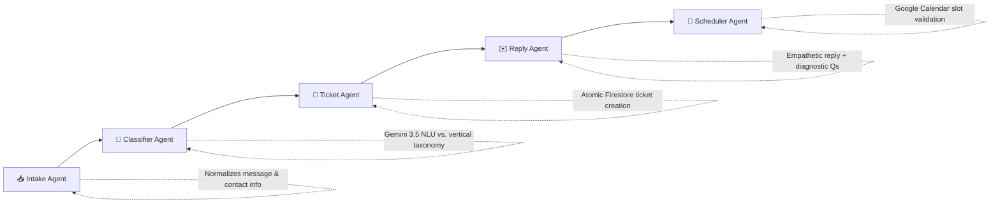

# Go-Taskmaster

**Turn unstructured customer messages into actionable tickets and booked appointments in less than a minute.**

Built for the **All Things Agentic Hackathon 2026** (Google + Devpost).

🚀 **Live Dashboard:** [https://go-taskmaster-1.web.app](https://go-taskmaster-1.web.app)  
📹 **Demo Video:** [YouTube Video Link](https://www.youtube.com/watch?v=jsJOhPfH5vE)

---

## Table of contents

- [What is Go-Taskmaster](#what-is-go-taskmaster)
- [Why it matters](#why-it-matters)
- [Architecture of the 5-Agent Pipeline](#architecture-of-the-5-agent-pipeline)
- [Vertical-Agnostic by Design](#vertical-agnostic-by-design)
- [Tech Stack & Google Cloud Architecture](#tech-stack--google-cloud-architecture)
- [Project Status](#project-status)
- [Repository Structure](#repository-structure)
- [Getting Started](#getting-started)
  - [Backend](#backend)
  - [Frontend](#frontend)
  - [Docker Compose](#docker-compose-both-at-once)
- [Running Tests](#running-tests)
- [Team](#team)

---

## What is Go-Taskmaster

Go-Taskmaster is an autonomous, multi-agent dispatch system that intercepts unstructured customer messages — SMS, email, web forms, and voice audio — and converts them into persistent support tickets, calendar bookings, and diagnostic reply drafts without requiring human intervention for standard requests.

**IT support / MSP operations is the flagship vertical and demo**, but the architecture is completely vertical-agnostic. The exact same pipeline serves dental clinics, home services, property management, and professional service firms through modular JSON/Pydantic taxonomy configuration packs in [`app/verticals/`](backend/app/verticals).

---

## Why It Matters

Go-Taskmaster isn't just basic ticketing automation. It eliminates the 15–30 minute operational lag of manual triage and walk-up requests:

- **Instant Triage:** Drops initial response time to sub-two seconds.
- **Targeted Troubleshooting:** Generates intelligent, empathetic replies with specific diagnostic questions (e.g., switch light states, affected user count).
- **Enterprise Safety:** Staged responses support human-in-the-loop verification before client dispatch.

---

## Architecture of the 5-Agent Pipeline

Each agent normalizes, enriches, and validates structured state using Pydantic v2 before passing it down the pipeline.



| #   | Agent          | Responsibility                                                                                                                                                    | Output Artifact     |
| --- | -------------- | ----------------------------------------------------------------------------------------------------------------------------------------------------------------- | ------------------- |
| 1   | **Intake**     | Normalizes incoming payloads/transcripts across all channels into a single schema; extracts customer identity.                                                    | `NormalizedMessage` |
| 2   | **Classifier** | Leverages **Gemini 3.5 Flash** for deep intent classification, urgency grading (`CRITICAL`, `HIGH`, `MEDIUM`, `LOW`), sentiment analysis, and confidence scoring. | `Classification`    |
| 3   | **Ticket**     | Atomically fetches sequential counters (`#TK-0046`), assigns technical roles, and persists records to **Cloud Firestore**.                                        | `Ticket`            |
| 4   | **Reply**      | Formulates empathetic, context-matched customer drafts with up to 3 targeted diagnostic questions.                                                                | `ReplyDraft`        |
| 5   | **Scheduler**  | Analyzes calendar constraints, proposes meeting windows, and determines whether dispatch is required.                                                             | `Appointment`       |

---

## Vertical-Agnostic by Design

Four complete vertical configuration packs ship ready in [`backend/app/verticals/packs/`](https://www.google.com/search?q=backend/app/verticals/packs):

| Vertical              | Mode              | "Urgent" Definition                                           |
| --------------------- | ----------------- | ------------------------------------------------------------- |
| `it_support`          | **Flagship Demo** | Complete business outage, down switch/firewall, site offline  |
| `dental_clinic`       | Ready             | Severe acute pain, active bleeding, facial trauma             |
| `home_services`       | Ready             | Active water leak, gas smell, electrical hazard, loss of heat |
| `property_management` | Ready             | Structural damage, flooding, no heat/AC in extreme weather    |

---

## Tech Stack & Google Cloud Architecture

- **AI Reasoning:** Gemini 3.5 Flash via Google GenAI SDK (`google-genai`) on Gemini Enterprise Agent Platform
- **Backend:** Python 3.11, FastAPI, Uvicorn, Pydantic v2
- **Database & Persistence:** Google Cloud Firestore (NoSQL state, atomic counters, customer history)
- **Compute & Ingestion:** Google Cloud Run (serverless containerized runtime), Cloud Pub/Sub
- **Security:** Google Secret Manager (`GEMINI_API_KEY`)
- **Frontend & Hosting:** React 18, Vite, Tailwind CSS, Lucide Icons, Firebase Hosting

---

## Project Status

- ✅ **Shared Models (`app/models/`):** Strict Pydantic v2 schema validation contracts.
- ✅ **5-Agent Pipeline (`app/agents/`):** Full end-to-end multi-agent orchestration using Gemini 3.5 Flash.
- ✅ **Persistence Engine (`app/services/`):** Production `FirestoreRepo` with atomic counter transactions and zero-dependency `InMemoryRepo` for local development.
- ✅ **Vertical Config Engine (`app/verticals/`):** 4 active industry packs with customized taxonomies.
- ✅ **Cloud Infrastructure:** Deployed and serving live on Google Cloud Run and Firebase Hosting.
- ✅ **Live Web Visualizer (`frontend/`):** Split-screen dashboard with preset simulations and real-time execution trace logs.
- 🟡 **External Calendar Provider Sync:** Scheduler Agent evaluates slot necessity, constraints, and booking intent autonomously; live 2-way Google Calendar OAuth sync is architected for post-hackathon release.

---

## Repository Structure

```
taskmaster/
├── backend/
│   ├── app/
│   │   ├── main.py, config.py            # FastAPI entrypoint + fail-loud typed settings
│   │   ├── core/timing.py                # Per-stage execution timer + live trace bus
│   │   ├── models/                       # Pydantic v2 contracts (Ticket, Message, etc.)
│   │   ├── verticals/                    # Vertical config schemas, loader, and packs
│   │   ├── services/                     # FirestoreRepo + InMemoryRepo implementations
│   │   ├── agents/                       # 5-stage agent modules (Intake, Classifier, Ticket, Reply, Scheduler)
│   │   ├── integrations/                 # Gemini GenAI client and cloud adapters
│   │   └── api/routes/                   # Live endpoints (/api/simulate, webhooks)
│   ├── tests/                            # Pytest test suite (100% green against InMemoryRepo)
│   └── pyproject.toml
├── frontend/                             # React 18 + Vite + Tailwind CSS dashboard
├── docs/                                 # PRD, architecture blueprints, demo flow
├── GEMINI.md                             # Architectural specification & engineering rules
└── docker-compose.yml                    # Local multi-container development configuration

```

---

## Getting Started

### Backend

```bash
cd backend
python -m venv .venv
source .venv/bin/activate    # On Windows: .venv\Scripts\Activate.ps1
pip install -e .
cp .env.example .env
uvicorn app.main:app --reload --port 8000

```

Health check: `GET http://localhost:8000/health`

### Frontend

```bash
cd frontend
npm install
npm run dev
```

### Docker Compose (Both at once)

```bash
docker compose up
```

Backend accessible on `:8000`, frontend on `:5173`.

---

## Running Tests

```bash
cd backend
pytest

```

---

## Team

Built for the **All Things Agentic Hackathon 2026**:

- **Morgan King** – System Architecture, Cloud Infrastructure & Lead Developer
- **Habib Ur Rahman** – Agent Pipeline Engineering & Backend Routing
- **Michael Pereira** – QA, Test Engineering & Reliability
- **Ashvin Kumar** – Frontend Dashboard & Interface Integration
